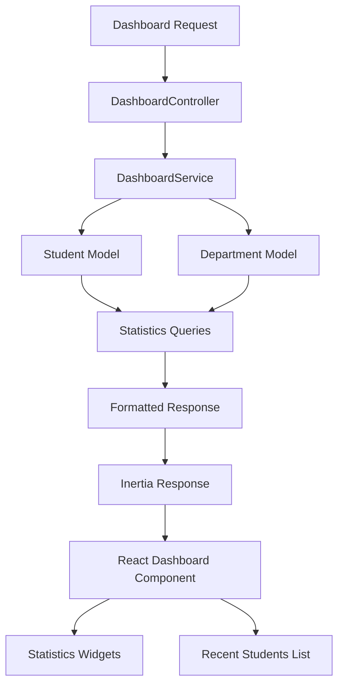

# Design Document

## Overview

The dashboard enhancement feature transforms the existing basic dashboard into a comprehensive administrative interface with real-time statistics, advanced data management capabilities, and modern UI/UX design. The solution leverages Laravel's Eloquent ORM for efficient data queries, Inertia.js for seamless frontend-backend communication, and React with TypeScript for a responsive user interface.

## Architecture

### Backend Architecture

The backend follows Laravel's MVC pattern with the following enhancements:

- **Controllers**: Enhanced StudentController and DepartmentController with sorting, filtering, and pagination logic
- **Models**: Extended Student and Department models with statistical query scopes
- **Services**: New DashboardService for aggregating statistics and metrics
- **Resources**: API resources for consistent data formatting

### Frontend Architecture

The frontend uses React with TypeScript and follows a component-based architecture:

- **Pages**: Enhanced Dashboard, Students/Index, and Departments/Index pages
- **Components**: Reusable UI components for statistics, tables, pagination, and sorting
- **Hooks**: Custom hooks for data fetching, sorting, and pagination state management
- **Types**: TypeScript interfaces for type safety

### Data Flow



## Components and Interfaces

### Backend Components

#### DashboardController
```php
class DashboardController extends Controller
{
    public function index(): Response
    {
        return Inertia::render('Dashboard', [
            'statistics' => DashboardService::getStatistics(),
            'recentStudents' => DashboardService::getRecentStudents(),
        ]);
    }
}
```

#### DashboardService
```php
class DashboardService
{
    public static function getStatistics(): array
    {
        return [
            'totalStudents' => Student::count(),
            'maleStudents' => Student::where('gender', 'male')->count(),
            'femaleStudents' => Student::where('gender', 'female')->count(),
            'totalDepartments' => Department::where('status', 'active')->count(),
        ];
    }

    public static function getRecentStudents(): Collection
    {
        return Student::with('department')
            ->latest()
            ->limit(5)
            ->get();
    }
}
```

#### Enhanced StudentController
```php
public function index(Request $request): Response
{
    $query = Student::with('department');
    
    // Apply sorting
    if ($request->has('sort')) {
        $sortField = $request->get('sort');
        $sortDirection = $request->get('direction', 'asc');
        $query->orderBy($sortField, $sortDirection);
    }
    
    // Apply search
    if ($request->has('search')) {
        $search = $request->get('search');
        $query->where(function($q) use ($search) {
            $q->where('name', 'like', "%{$search}%")
              ->orWhere('email', 'like', "%{$search}%");
        });
    }
    
    return Inertia::render('Students/Index', [
        'students' => $query->paginate(10)->withQueryString(),
        'filters' => $request->only(['search', 'sort', 'direction']),
    ]);
}
```

### Frontend Components

#### StatisticsCard Component
```typescript
interface StatisticsCardProps {
    title: string;
    value: number;
    icon: React.ReactNode;
    color: 'blue' | 'green' | 'purple' | 'orange';
}

const StatisticsCard: React.FC<StatisticsCardProps> = ({ title, value, icon, color }) => {
    return (
        <div className={`bg-white rounded-lg shadow p-6 border-l-4 border-${color}-500`}>
            <div className="flex items-center">
                <div className={`p-3 rounded-full bg-${color}-100 text-${color}-600`}>
                    {icon}
                </div>
                <div className="ml-4">
                    <p className="text-sm font-medium text-gray-600">{title}</p>
                    <p className="text-2xl font-semibold text-gray-900">{value}</p>
                </div>
            </div>
        </div>
    );
};
```

#### SortableTable Component
```typescript
interface SortableTableProps {
    columns: TableColumn[];
    data: any[];
    sortField?: string;
    sortDirection?: 'asc' | 'desc';
    onSort: (field: string) => void;
}

const SortableTable: React.FC<SortableTableProps> = ({ 
    columns, 
    data, 
    sortField, 
    sortDirection, 
    onSort 
}) => {
    return (
        <Table>
            <TableHeader>
                <TableRow>
                    {columns.map((column) => (
                        <TableHead 
                            key={column.key}
                            className={column.sortable ? 'cursor-pointer hover:bg-gray-50' : ''}
                            onClick={() => column.sortable && onSort(column.key)}
                        >
                            <div className="flex items-center space-x-1">
                                <span>{column.label}</span>
                                {column.sortable && (
                                    <SortIcon 
                                        field={column.key} 
                                        currentSort={sortField} 
                                        direction={sortDirection} 
                                    />
                                )}
                            </div>
                        </TableHead>
                    ))}
                </TableRow>
            </TableHeader>
            <TableBody>
                {data.map((row, index) => (
                    <TableRow key={index}>
                        {columns.map((column) => (
                            <TableCell key={column.key}>
                                {column.render ? column.render(row) : row[column.key]}
                            </TableCell>
                        ))}
                    </TableRow>
                ))}
            </TableBody>
        </Table>
    );
};
```

#### PaginationControls Component
```typescript
interface PaginationControlsProps {
    currentPage: number;
    lastPage: number;
    total: number;
    perPage: number;
    onPageChange: (page: number) => void;
}

const PaginationControls: React.FC<PaginationControlsProps> = ({
    currentPage,
    lastPage,
    total,
    perPage,
    onPageChange
}) => {
    const startItem = (currentPage - 1) * perPage + 1;
    const endItem = Math.min(currentPage * perPage, total);
    
    return (
        <div className="flex items-center justify-between px-4 py-3 bg-white border-t border-gray-200">
            <div className="flex-1 flex justify-between sm:hidden">
                <Button 
                    variant="outline" 
                    disabled={currentPage === 1}
                    onClick={() => onPageChange(currentPage - 1)}
                >
                    Previous
                </Button>
                <Button 
                    variant="outline" 
                    disabled={currentPage === lastPage}
                    onClick={() => onPageChange(currentPage + 1)}
                >
                    Next
                </Button>
            </div>
            <div className="hidden sm:flex-1 sm:flex sm:items-center sm:justify-between">
                <div>
                    <p className="text-sm text-gray-700">
                        Showing <span className="font-medium">{startItem}</span> to{' '}
                        <span className="font-medium">{endItem}</span> of{' '}
                        <span className="font-medium">{total}</span> results
                    </p>
                </div>
                <div className="flex space-x-1">
                    {/* Page number buttons */}
                </div>
            </div>
        </div>
    );
};
```

## Data Models

### Enhanced Student Model
```php
class Student extends Model
{
    protected $fillable = [
        'name', 'email', 'phone', 'address', 'gender', 'department_id'
    ];

    protected $casts = [
        'gender' => 'string',
        'created_at' => 'datetime',
    ];

    protected $appends = ['registered_at'];

    public function department(): BelongsTo
    {
        return $this->belongsTo(Department::class);
    }

    public function getRegisteredAtAttribute(): string
    {
        return $this->created_at->format('M d, Y');
    }

    public function scopeByGender($query, string $gender)
    {
        return $query->where('gender', $gender);
    }

    public function scopeRecent($query, int $limit = 5)
    {
        return $query->latest()->limit($limit);
    }
}
```

### Enhanced Department Model
```php
class Department extends Model
{
    protected $fillable = [
        'name', 'description', 'duration', 'status'
    ];

    protected $casts = [
        'status' => 'string',
        'created_at' => 'datetime',
    ];

    public function students(): HasMany
    {
        return $this->hasMany(Student::class);
    }

    public function scopeActive($query)
    {
        return $query->where('status', 'active');
    }

    public function getStudentCountAttribute(): int
    {
        return $this->students()->count();
    }
}
```

### TypeScript Interfaces
```typescript
interface DashboardStatistics {
    totalStudents: number;
    maleStudents: number;
    femaleStudents: number;
    totalDepartments: number;
}

interface Student {
    id: number;
    name: string;
    email: string;
    phone: string;
    address: string;
    gender: 'male' | 'female' | 'other';
    department_id: number;
    department?: Department;
    registered_at: string;
    created_at: string;
    updated_at: string;
}

interface Department {
    id: number;
    name: string;
    description: string;
    duration: string;
    status: 'active' | 'inactive';
    student_count?: number;
    created_at: string;
    updated_at: string;
}

interface PaginatedData<T> {
    data: T[];
    current_page: number;
    last_page: number;
    per_page: number;
    total: number;
    from: number;
    to: number;
}

interface TableColumn {
    key: string;
    label: string;
    sortable: boolean;
    render?: (item: any) => React.ReactNode;
}
```

## Error Handling

### Backend Error Handling
- **Validation Errors**: Laravel form request validation with custom error messages
- **Database Errors**: Try-catch blocks with appropriate error responses
- **Authorization Errors**: Middleware-based access control with proper error pages

### Frontend Error Handling
- **API Errors**: Centralized error handling with toast notifications
- **Loading States**: Skeleton loaders and loading indicators
- **Empty States**: Proper messaging when no data is available

```typescript
const useStudents = (filters: StudentFilters) => {
    const [loading, setLoading] = useState(false);
    const [error, setError] = useState<string | null>(null);
    
    const fetchStudents = useCallback(async () => {
        try {
            setLoading(true);
            setError(null);
            // Fetch logic
        } catch (err) {
            setError('Failed to load students');
            toast.error('Failed to load students');
        } finally {
            setLoading(false);
        }
    }, [filters]);
    
    return { loading, error, fetchStudents };
};
```

## Testing Strategy

### Backend Testing
- **Unit Tests**: Test individual methods in controllers and services
- **Feature Tests**: Test complete request-response cycles
- **Database Tests**: Test model relationships and query scopes

```php
class DashboardServiceTest extends TestCase
{
    public function test_get_statistics_returns_correct_counts()
    {
        Student::factory()->count(10)->create(['gender' => 'male']);
        Student::factory()->count(8)->create(['gender' => 'female']);
        
        $statistics = DashboardService::getStatistics();
        
        $this->assertEquals(18, $statistics['totalStudents']);
        $this->assertEquals(10, $statistics['maleStudents']);
        $this->assertEquals(8, $statistics['femaleStudents']);
    }
}
```

### Frontend Testing
- **Component Tests**: Test individual React components with React Testing Library
- **Integration Tests**: Test component interactions and data flow
- **E2E Tests**: Test complete user workflows

```typescript
describe('StatisticsCard', () => {
    it('displays the correct title and value', () => {
        render(
            <StatisticsCard 
                title="Total Students" 
                value={42} 
                icon={<UserIcon />} 
                color="blue" 
            />
        );
        
        expect(screen.getByText('Total Students')).toBeInTheDocument();
        expect(screen.getByText('42')).toBeInTheDocument();
    });
});
```

## Performance Considerations

### Database Optimization
- **Eager Loading**: Load relationships to prevent N+1 queries
- **Indexing**: Add database indexes on frequently queried columns
- **Query Optimization**: Use efficient queries for statistics and pagination

### Frontend Optimization
- **Code Splitting**: Lazy load components and pages
- **Memoization**: Use React.memo and useMemo for expensive calculations
- **Virtual Scrolling**: For large datasets (future enhancement)

### Caching Strategy
- **Query Caching**: Cache frequently accessed statistics
- **Browser Caching**: Proper cache headers for static assets
- **State Management**: Efficient state updates to prevent unnecessary re-renders